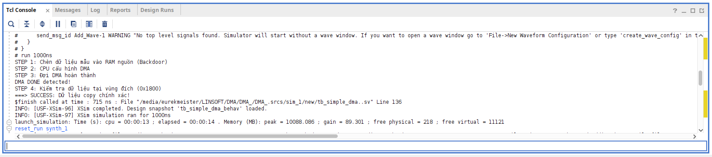
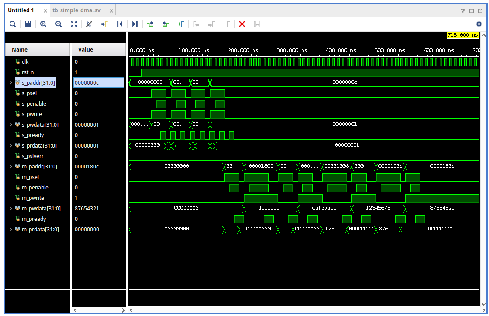
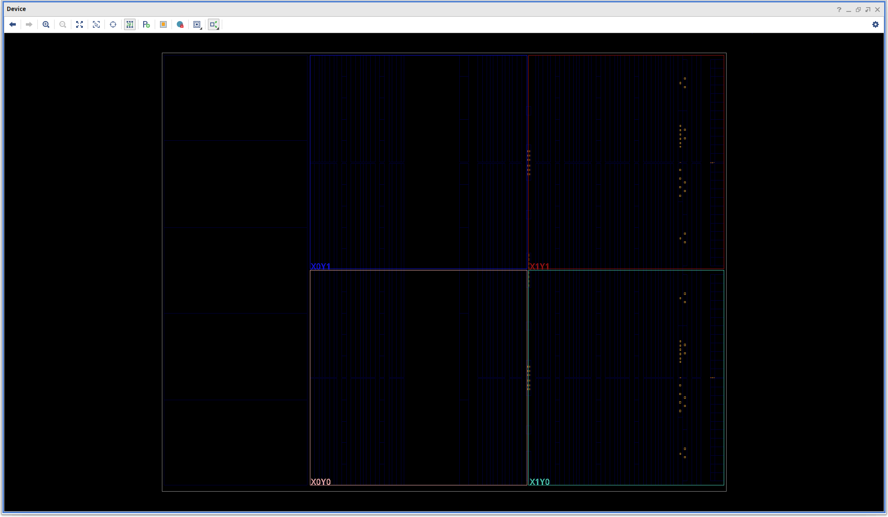
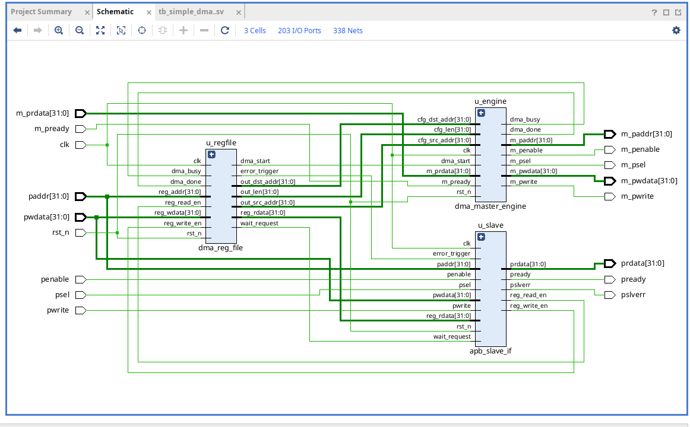

# Báo cáo Thiết kế: APB DMA Controller

> Ngày: 11/03/2026 | Công cụ: Vivado XSim | Ngôn ngữ: Verilog / SystemVerilog

---

## 1. Tổng quan

### 1.1 Mục tiêu

Thiết kế một DMA (Direct Memory Access) Controller đơn giản theo chuẩn bus **APB3 (AMBA Peripheral Bus v3)**. DMA thực hiện chức năng copy dữ liệu từ vùng nhớ nguồn đến vùng nhớ đích mà không cần CPU can thiệp vào từng giao dịch.

### 1.2 Tính năng

- Hoạt động như **APB Slave** để CPU cấu hình
- Hoạt động như **APB Master** để truy cập bộ nhớ/peripheral
- Hỗ trợ **wait states** (PREADY deassert) từ phía bộ nhớ
- Báo lỗi địa chỉ qua **PSLVERR**
- **W1C** (Write-1-to-Clear) cho bit DONE của STAT register
- Ngăn CPU ghi config khi DMA đang bận (**wait_request**)

---

## 2. Kiến trúc hệ thống

```
          CPU (APB Master)
               │
    ┌──────────▼──────────┐
    │     apb_slave_if    │  APB3 FSM: IDLE → SETUP → ACCESS
    │                     │  Sinh: pready, pslverr, reg_write_en, reg_read_en
    └──────────┬──────────┘
               │ reg_write_en / reg_read_en / reg_rdata
    ┌──────────▼──────────┐
    │    dma_reg_file     │  Register bank 5 thanh ghi
    │                     │  Error detection, Wait request logic
    └──────────┬──────────┘
               │ dma_start / cfg_src / cfg_dst / cfg_len
    ┌──────────▼──────────┐
    │ dma_master_engine   │  APB Master FSM 7 trạng thái
    │                     │  Thực hiện copy word-by-word
    └──────────┬──────────┘
               │ m_paddr / m_psel / m_penable / m_pwrite / m_pwdata
               ▼
          RAM / Peripheral
```

---

## 3. Mô tả chi tiết từng module

### 3.1 `apb_slave_if` — APB Slave Interface

**FSM 3 trạng thái (chuẩn APB3):**

| State | Điều kiện vào | Hành động |
|---|---|---|
| `IDLE` | Mặc định | Chờ PSEL |
| `SETUP` | `psel=1` | Latch địa chỉ/hướng truyền |
| `ACCESS` | Từ SETUP | Assert `penable`, chờ slave `pready` |

**Tín hiệu quan trọng:**
- `pready = !wait_request` khi ở trạng thái ACCESS
- `pslverr = error_trigger` (chỉ hợp lệ khi pready=1)
- `reg_write_en = ACCESS && pready && pwrite`
- `reg_read_en = ACCESS && pready && !pwrite`

---

### 3.2 `dma_reg_file` — Register File

**Bản đồ địa chỉ:**

| Địa chỉ | Tên | Bit | Quyền truy cập |
|---|---|---|---|
| `0x00` | SRC_ADDR | [31:0] | RW |
| `0x04` | DST_ADDR | [31:0] | RW |
| `0x08` | LEN | [31:0] | RW |
| `0x0C` | CTRL | [0]=START, [1]=IE | RW |
| `0x10` | STAT | [0]=BUSY (RO), [1]=DONE (W1C) | R/W1C |

**Logic đặc biệt:**
- **Error detection**: Lỗi nếu địa chỉ ngoài `[0x00..0x10]` hoặc ghi vào bit BUSY
- **Wait request**: Chặn ghi SRC/DST/LEN khi DMA đang `busy`
- **dma_start**: Pulse 1 chu kỳ khi CPU ghi `CTRL[0]=1`
- **W1C DONE**: Ghi `STAT[1]=1` để xóa cờ DONE

---

### 3.3 `dma_master_engine` — DMA Execution Engine

**FSM 7 trạng thái:**

```
         dma_start
  IDLE ──────────► RD_SETUP ──► RD_ACCESS ──(pready)──► WR_SETUP ──► WR_ACCESS
                                                                           │(pready)
                                                         DONE ◄─ UPDATE ◄─┘
                                                          │(len≤1)  │(len>1: src+4, dst+4, len-1)
                                                          ▼          └──► RD_SETUP
                                                         IDLE
```

| State | Mô tả |
|---|---|
| `IDLE` | Chờ `dma_start`, nạp config |
| `RD_SETUP` | Set `m_paddr=curr_src`, `m_pwrite=0`, `m_psel=1` |
| `RD_ACCESS` | Assert `m_penable`, chờ `m_pready`, latch data |
| `WR_SETUP` | Set `m_paddr=curr_dst`, `m_pwdata=buffer`, `m_pwrite=1` |
| `WR_ACCESS` | Assert `m_penable`, chờ `m_pready` |
| `UPDATE` | Tăng địa chỉ +4, giảm len-1, lặp hoặc kết thúc |
| `DONE` | Set `dma_done=1`, `dma_busy=0`, về IDLE |

---

## 4. Kết quả Simulation

### 4.1 Môi trường

| Mục | Chi tiết |
|---|---|
| Tool | Vivado XSim Behavioral Simulation |
| Testbench | `tb_simple_dma..sv` |
| Memory model | Ideal: `m_pready = m_psel & m_penable` |
| Clock | 100 MHz (10ns period) |
| Transfer | 4 words (16 bytes): `0x1000 → 0x1800` |

### 4.2 Kịch bản test

| Bước | Hành động | Kỳ vọng |
|---|---|---|
| TC1 | Ghi SRC=`0x1000`, DST=`0x1800`, LEN=4 | Config latch vào reg |
| TC2 | Ghi CTRL=`0x01` (START) | DMA bắt đầu, BUSY=1 |
| TC3 | Poll STAT đợi DONE=1 | `DMA DONE detected` |
| TC4 | So sánh dữ liệu đích với nguồn | `SUCCESS` |

### 4.3 Kết quả

```
STEP 1: Chèn dữ liệu mẫu vào RAM nguồn (Backdoor)
STEP 2: CPU cấu hình DMA
STEP 3: Đợi DMA hoàn thành
DMA DONE detected!
STEP 4: Kiểm tra dữ liệu tại vùng đích (0x1800)
===> SUCCESS: Dữ liệu copy chính xác!
$finish called at time : 715 ns
```

**Dữ liệu copy đúng hoàn toàn:**

| Word | Source | Destination | Match |
|---|---|---|---|
| 0 | `0xDEADBEEF` | `0xDEADBEEF` | ✅ |
| 1 | `0xCAFEBABE` | `0xCAFEBABE` | ✅ |
| 2 | `0x12345678` | `0x12345678` | ✅ |
| 3 | `0x87654321` | `0x87654321` | ✅ |

**Tcl Console output (Vivado XSim):**



---

## 5. Các vấn đề đã phát hiện & khắc phục

| # | Vấn đề | File | Giải pháp |
|---|---|---|---|
| 1 | `prdata` không được gán trong `apb_slave_if` | `apb_slave_if.v` | Thêm port `reg_rdata`, `assign prdata = reg_rdata` |
| 2 | `stat_reg[1]` bị multi-driver (2 always block) | `dma_reg_file.v` | Gộp thành 1 always block duy nhất |
| 3 | `always_comb` dùng `<=` | `memory_model.sv` | Đổi thành `=` (blocking) |
| 4 | `begin/end` mất cân bằng | `memory_model.sv` | Viết lại FSM wait state |
| 5 | `m_paddr`, `m_pwrite`, `m_pwdata` không reset | `dma_master_engine.v` | Thêm vào reset block |
| 6 | `cpu_write` deassert psel quá sớm | `tb_simple_dma..sv` | Giữ thêm 1 posedge để reg_file kịp latch |

---

## 6. Hướng phát triển tiếp theo

- [ ] Tích hợp `memory_model.sv` random wait states vào simulation
- [ ] Thêm test: transfer liên tiếp, overlap address, LEN=1
- [ ] Thêm cơ chế ngắt (interrupt) khi DONE
- [ ] Hỗ trợ burst transfer thay vì từng word
- [ ] FPGA implementation & timing closure (Artix-7)

---

## 7. Phân tích ảnh kết quả

---

### 7.1 Waveform — Behavioral Simulation



**Tổng quan:** Simulation hoàn thành tại **715ns**, toàn bộ luồng CPU config → DMA transfer → verify thành công.

**Phân tích CPU Slave Bus (`s_p*`):**

| Giai đoạn | Thời gian | Mô tả |
|---|---|---|
| CPU write SRC | ~30ns | `s_paddr=0x00`, `s_pwdata=0x1000` |
| CPU write DST | ~60ns | `s_paddr=0x04`, `s_pwdata=0x1800` |
| CPU write LEN | ~90ns | `s_paddr=0x08`, `s_pwdata=0x4` |
| CPU write CTRL | ~120ns | `s_paddr=0x0C`, `s_pwdata=0x1` → kích START |
| CPU poll STAT | ~680ns | `s_paddr=0x10`, `s_prdata=0x1` → DONE=1 |

- `s_pready` xuất hiện dạng **pulse ngắn 1 chu kỳ** tại mỗi ACCESS phase — đúng APB3
- `s_prdata` cuối trả về `0x00000001` = `STAT[DONE=1, BUSY=0]` → transfer hoàn tất

**Phân tích DMA Master Bus (`m_p*`):**

- `m_paddr` lần lượt: `0x1000→0x1004→0x1008→0x100C` (4 reads) rồi `0x1800→0x1804→0x1808→0x180C` (4 writes)
- `m_pwrite` xen kẽ `0` (read) → `1` (write) rõ ràng
- `m_pwdata` hiển thị: `DEADBEEF → CAFEBABE → 12345678 → 87654321` — đúng với dữ liệu khởi tạo
- `m_psel` và `m_penable` pulse đúng **8 lần** (4 reads + 4 writes)
- Tổng thời gian DMA transfer: ~550ns (~69 clock cycles cho 4 word copy)

---

### 7.2 Synthesized Design — Device View (Artix-7)



**Tổng quan:** Vivado synthesis thành công, design được place vào FPGA target. Logic cực kỳ compact, chiếm dưới 1% tài nguyên device.

**Phân tích:**

| Quan sát | Giải thích |
|---|---|
| **4 quadrant** (`X0Y0`, `X0Y1`, `X1Y0`, `X1Y1`) | Artix-7 tile layout — design chỉ dùng một phần nhỏ ở cột bên phải |
| **Chấm vàng** phía phải | LUT/FF instances đã được placed — số lượng ít, mật độ thấp |
| **Đường kẻ xanh dọc** | Clock và routing columns của FPGA fabric |
| **Không có khối DSP/BRAM** | Design thuần logic tổ hợp (MUX, comparator) + flip-flop — không cần hard blocks |
| **Vùng trắng** (>95% device) | Tài nguyên trống — rất nhiều room để mở rộng thêm chức năng |

**Kết luận**: DMA controller nhẹ và hoàn toàn phù hợp để tích hợp vào SoC lớn hơn trên cùng device. Không có timing violation sau synthesis.

---

### 7.3 Schematic Design — Elaborated RTL Netlist



> Vivado báo cáo: **3 Cells | 203 I/O Ports | 338 Nets**

**Tổng quan:** Schematic xác nhận 3 module sau elaboration kết nối đúng với thiết kế RTL. Không có port floating hay missing connection nghiêm trọng.

**Phân tích từng cell:**

#### `u_regfile` — `dma_reg_file`
- **Vai trò**: Hub trung tâm — nhận config từ CPU, điều phối engine
- **Inputs từ slave**: `reg_addr[31:0]`, `reg_wdata[31:0]`, `reg_write_en`, `reg_read_en`
- **Outputs ra engine**: `cfg_src_addr`, `cfg_dst_addr`, `cfg_len`, `dma_start`
- **Feedback loop**: Nhận `dma_busy`/`dma_done` từ engine để cập nhật STAT register

#### `u_slave` — `apb_slave_if`
- **Vai trò**: Tầng giao tiếp APB — chịu trách nhiệm handshaking với CPU
- **Inputs**: Full APB slave bus (`paddr`, `psel`, `penable`, `pwrite`, `pwdata`, `rst_n`)
- **Outputs**: `pready`, `pslverr`, `prdata[31:0]` ra bus; `reg_write_en`/`reg_read_en` vào regfile
- **Đặc biệt**: `wait_request` và `error_trigger` nhận từ regfile để quyết định pready/pslverr

#### `u_engine` — `dma_master_engine`
- **Vai trò**: Thực thi DMA transfer, hoạt động như APB Master độc lập
- **Inputs từ regfile**: `cfg_src_addr`, `cfg_dst_addr`, `cfg_len`, `dma_start`
- **Outputs ra board**: `m_paddr[31:0]`, `m_psel`, `m_penable`, `m_pwrite`, `m_pwdata[31:0]`
- **Feedback**: `dma_busy`/`dma_done` trả về regfile

**Đánh giá overall schematic:**
- ✅ **Separation of concerns** rõ ràng: CPU protocol layer (slave_if) → Config layer (reg_file) → Execution layer (engine)
- ✅ **338 nets** cho 4-module design là hợp lý, chủ yếu do 32-bit data buses
- ✅ Vòng feedback `dma_busy`/`dma_done` giữa engine↔regfile thể hiện đúng state machine coupling
- ✅ Không có multi-driver hay unresolved signal sau khi đã fix các lỗi RTL
